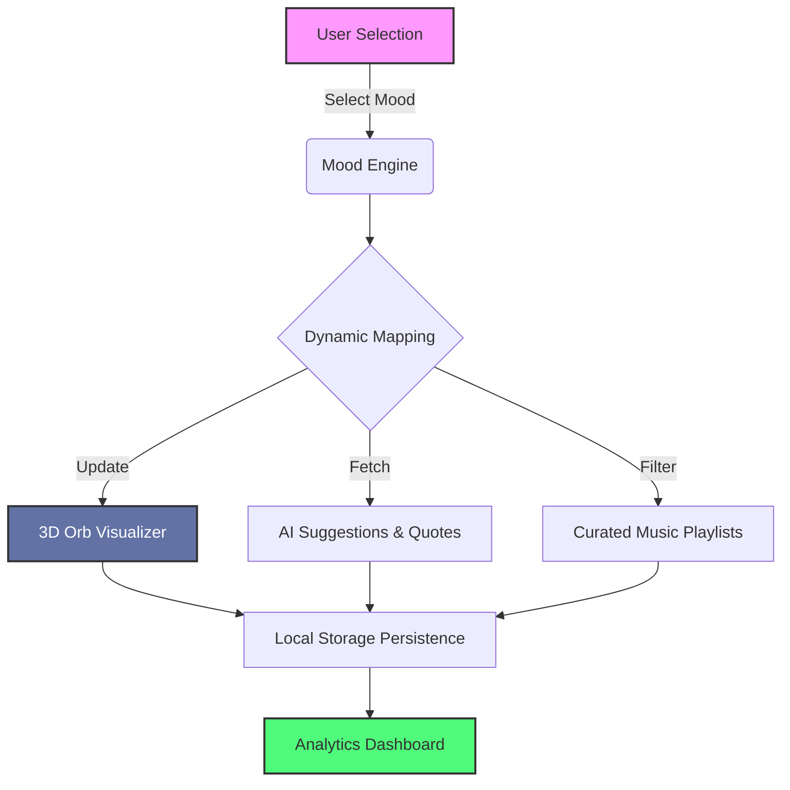

# 🌈 InnerHue - Emotional Reflection Web App

A beautifully animated emotional wellness platform that helps users explore, visualize, and understand their feelings through interactive mood tracking, 3D visualizations, and personalized insights.

<div align="center">


</div>

---

## ✨ Features

### 🎨 Mood Selection
- **20+ Emotional States**: From happiness to melancholy, each with unique colors and personalities
- **Floating Card Interface**: Disney-inspired 3D animations with shimmer and hover effects
- **Intuitive Design**: Beautiful gradient backgrounds and smooth transitions

### 🔮 3D Orb Visualizer
- **Dynamic Visualization**: Interactive orbs that change color, glow, and animation based on selected mood
- **Particle Effects**: Floating particles and ripple rings for immersive experience
- **Responsive Animations**: Smooth Framer Motion animations with customizable states

### 💬 AI-Powered Suggestions
- **Journal Prompts**: Thoughtful questions tailored to your emotional state
- **Inspirational Quotes**: Curated quotes from renowned authors and thinkers
- **Keyword Clouds**: Emotion-related words to expand emotional vocabulary
- **Music Recommendations**: Spotify-style playlists matching your mood

### 📊 Analytics Dashboard
- **Mood Tracking**: Visual charts showing emotional patterns over time
- **Statistics**: Daily, weekly, and overall mood insights
- **Recent Activity**: Timeline of your emotional journey
- **Progress Visualization**: Beautiful bar and pie charts

### 🎵 Music Integration
- **Curated Playlists**: Genre-specific music recommendations for each mood
- **Interactive Player**: Play/pause functionality with beautiful UI
- **Mood-Based Organization**: Easy switching between emotional soundscapes

---

## 🛠️ Tech Stack

- **Frontend**: Next.js 13 with App Router
- **Styling**: TailwindCSS with custom design system
- **Animations**: Framer Motion for smooth, professional animations
- **Icons**: Lucide React for consistent iconography
- **Data Storage**: Local Storage for client-side persistence
- **TypeScript**: Full type safety throughout the application

---

## 🗺️ System Architecture
To understand how InnerHue processes your emotional data, here is the high-level logic flow:


---

## 🎯 Design Philosophy

InnerHue follows **Apple-level design aesthetics** with:
- **Glassmorphism**: Backdrop blur effects and translucent cards
- **Micro-interactions**: Subtle hover states and tap feedback
- **Color Psychology**: Carefully chosen colors that match emotional states
- **Responsive Design**: Mobile-first approach with perfect cross-device experience
- **Accessibility**: High contrast ratios and intuitive navigation

---

## 🚀 Getting Started

1. **Clone the repository**
```bash
git clone https://github.com/Nitya-003/innerhue.git
cd innerhue
```

2. **Install dependencies**
```bash
npm install
```

3. **Run the development server**
```bash
npm run dev
```

## 🐳 Docker Deployment

InnerHue is fully containerized for consistent deployment across environments.

### Prerequisites
- Docker Engine 20.10+
- Docker Compose 2.0+ (optional but recommended)

### Quick Start with Docker Compose

1. **Production deployment (recommended)**
```bash
docker-compose up innerhue
```

2. **Development with hot reload**
```bash
docker-compose --profile dev up innerhue-dev
```

### Manual Docker Commands

1. **Build the Docker image**
```bash
docker build -t innerhue .
```

2. **Run the container**
```bash
docker run -p 3000:3000 innerhue
```

3. **Access the application**
Open [http://localhost:3000](http://localhost:3000) in your browser

### Docker Image Details
- **Base Image**: `node:18-alpine` for optimal size and security
- **Multi-stage Build**: Separate stages for dependencies, building, and runtime
- **Image Size**: < 300MB (optimized for production)
- **Architecture**: Supports both AMD64 and ARM64 (Apple Silicon)

### Environment Variables
```bash
NODE_ENV=production          # Set environment mode
NEXT_TELEMETRY_DISABLED=1   # Disable Next.js telemetry
PORT=3000                   # Application port (default: 3000)
HOSTNAME=0.0.0.0           # Bind to all network interfaces
```

### Docker Development Workflow
```bash
# Pull the latest image from GitHub Container Registry
docker pull ghcr.io/nitya-003/innerhue:latest

# Or build locally with caching
docker build --target runner -t innerhue:local .

# Run with custom environment
docker run -d \
  --name innerhue-prod \
  --restart unless-stopped \
  -p 3000:3000 \
  -e NODE_ENV=production \
  innerhue:local
```

### Health Checks
The Docker container includes health checks to ensure reliability:
```bash
# Check container health
docker inspect innerhue-app --format='{{.State.Health.Status}}'

# View health check logs
docker inspect innerhue-app --format='{{range .State.Health.Log}}{{.Output}}{{end}}'
```

### CI/CD Integration
Every push and PR automatically:
- ✅ Runs linting and security audits
- ✅ Builds and tests Docker images
- ✅ Validates image size (< 300MB)
- ✅ Performs security vulnerability scanning
- ✅ Deploys to GitHub Container Registry

---

## 🎨 Color System

InnerHue uses a comprehensive emotional color palette:
- **Happy**: Golden yellows (#FFD93D)
- **Calm**: Peaceful greens (#66BB6A)
- **Sad**: Soothing blues (#42A5F5)
- **Excited**: Vibrant purples (#AB47BC)
- **Anxious**: Warm oranges (#FF7043)

---

## 🔄 Future Enhancements

- [ ] **Backend Integration**: Express.js API with MongoDB
- [ ] **Real NLP**: OpenAI or Cohere integration for dynamic suggestions
- [ ] **Social Features**: Share insights with friends and family
- [ ] **Voice Journaling**: Audio recordings with sentiment analysis
- [ ] **Meditation Timer**: Guided meditation based on current mood
- [ ] **Wearable Integration**: Apple Watch and Fitbit mood tracking

---
## 👥 Contributors

Thanks to these amazing people for contributing 💙

<a href="https://github.com/Nitya-003/InnerHue/graphs/contributors">
  
</a>


## 🤝 Contributing

We welcome contributions! Please feel free to submit a Pull Request. For major changes, please open an issue first to discuss what you would like to change.

## 📄 License

This project is licensed under the MIT License - see the [LICENSE](LICENSE) file for details.

## 🙏 Acknowledgments

- **Framer Motion** for incredible animation capabilities
- **TailwindCSS** for the flexible design system
- **Next.js** for the amazing developer experience
- **Inspiration** from emotional wellness platforms and modern design trends

---

**InnerHue** - *Discover the colors of your emotions* 🌈✨
